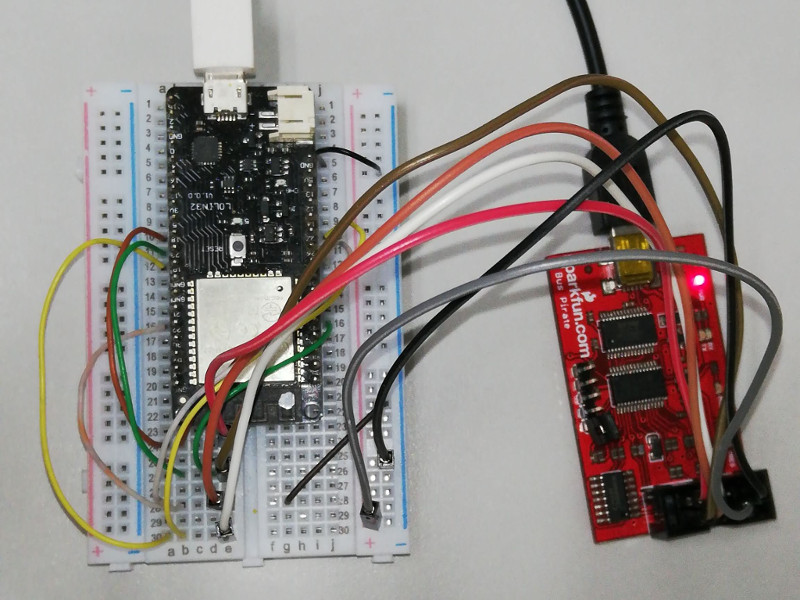
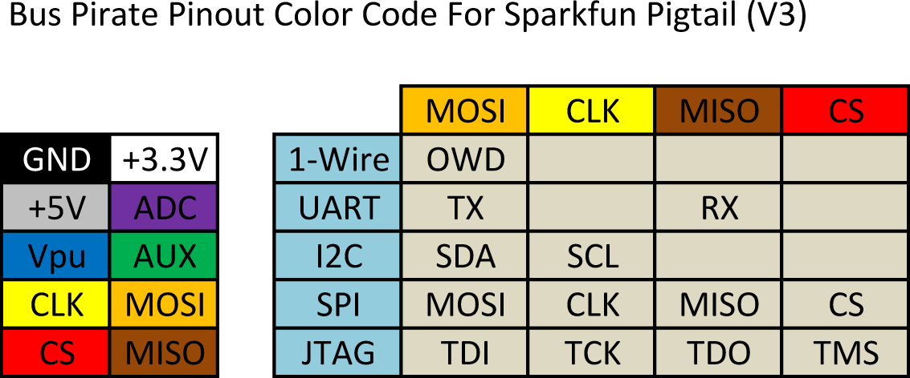

# SPI-Slave Class for ESP32.

This class is designed for interfacing with ESP32 SPI module in slave mode.
It means to be used and tested on Arduino platform.
The main idea of testing with the main arduino .ino file 
    is only to connect between SPI-Master signals and of the Slave.
Further information could be found in the topics.

Cheer!
iPAS

## Acknowledgement

The code was adopted from https://gist.github.com/shaielc/e0937d68978b03b2544474b641328145.
Thank you to @shaielc for the scaffolding.
Then I found it works a bit currently.
However, the adaptation is still required so a SPI-Slave module is functional
(_transfer data via DMA is disable_).

## Setup

To test the code, please wiring as the following figure:

The connections are described:

<table> <tr><td>

| Signal | Pin# |
|:------:|:----:|
| MO     | 22   |
| MI     | 23   |
| MCLK   | 19   |
| MS     | 18   |
| SO     | 32   |
| SI     | 25   |
| SCLK   | 27   |
| SS     | 34   |

<td>

</tr></table>

## Debugging

I also use the BusPirate for debugging.
It is just an option, can be neglected.
But, if you have one, 
    [SPI-sniffer](
    http://dangerousprototypes.com/docs/Bus_Pirate_binary_SPI_sniffer_utility) 
    article and the following BusPirate pinout maybe help:

## Note 

* In case of Arduino IDE, please rename test.ino as your folder name.
* You would see that the master cannot get the correct reponsed data.
    The received response is __shifted left by one bit__. 
    I am not sure why this is occured.
    However, the SlaveSPI class works correctly.
    * Update: the problem was fixed by the guide from [spi timing #1427](
    https://github.com/espressif/arduino-esp32/issues/1427).

## Future Works

* NEW found possible solution for [DMA buffer](
https://docs.espressif.com/projects/esp-idf/en/latest/api-guides/general-notes.html#dma-capable-requirement).
